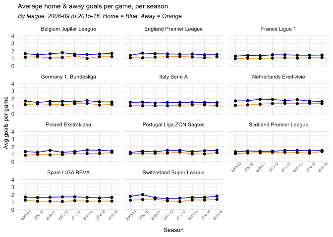

European Soccer database analysis
================
greg dubrow
June 09, 2019

European soccer data set sourced from Kaggle at
<https://www.kaggle.com/hugomathien/soccer> Some variable definitions:
<http://www.football-data.co.uk/notes.txt>

First stage of analysis will look at match data. Challenge here is to
merge the more descriptive league and team information into the match
set, and derive new variables such as average goals scored per game, per
season, per stage in season.

``` r
## Date load and prep

# set driver and establish connection to sqlite database
sqlite <- dbDriver("SQLite")
con <- dbConnect(sqlite,"eurosoccer.sqlite") ## will require full path if not in wd

# list tables in db
dbListTables(con)
```

    ## [1] "Country"           "League"            "Match"            
    ## [4] "Player"            "Player_Attributes" "Team"             
    ## [7] "Team_Attributes"   "sqlite_sequence"

``` r
# create dataframes to use in inital analysis
country <- tbl_df(dbGetQuery(con,"SELECT * FROM Country"))
league <- tbl_df(dbGetQuery(con,"SELECT * FROM League"))
team   <- tbl_df(dbGetQuery(con,"SELECT * FROM Team"))
matchdb  <- tbl_df(dbGetQuery(con,"SELECT * FROM Match"))

# in the working dataprep file eurosoccer dataprep and explore.R glimpses are not commented out
# glimpse(country)
# glimpse(league)
# glimpse(team)
# glimpse(matchdb)

## create table with country name, league name and all teams
# country id and league id are the same
# merge league & country on id
teamalla <- left_join(country, league, by = "id") %>%
  rename(country = name.x, league = name.y) %>%
  select(country_id, country, league) %>%
  arrange(country_id)
# get team id w/ (league/country) id, keep one record per team
teamallb <- matchdb %>%
  select(country_id, home_team_api_id) %>%
  distinct(home_team_api_id, .keep_all = TRUE) %>%
  rename(team_api_id = home_team_api_id) %>%
  arrange(country_id, team_api_id)
# merge these two together to get team ids with country and league
teamallc <- left_join(teamallb, teamalla, by = "country_id")
# merge with team file arrange by league, team name
teamall <- left_join(team, teamallc, by = "team_api_id") %>%
  select(country_id, country, league, team_api_id, team_fifa_api_id, team_long_name, team_short_name) %>%
  mutate(team_long_name = str_replace_all(team_long_name, "1. ", "")) %>%
  arrange(league, team_long_name )

glimpse(teamall)
```

    ## Observations: 299
    ## Variables: 7
    ## $ country_id       <int> 1, 1, 1, 1, 1, 1, 1, 1, 1, 1, 1, 1, 1, 1, 1, 1,…
    ## $ country          <chr> "Belgium", "Belgium", "Belgium", "Belgium", "Be…
    ## $ league           <chr> "Belgium Jupiler League", "Belgium Jupiler Leag…
    ## $ team_api_id      <int> 9993, 8342, 7947, 9991, 6351, 9987, 9984, 9999,…
    ## $ team_fifa_api_id <int> 675, 231, NA, 674, 2013, 673, 1750, 546, 100081…
    ## $ team_long_name   <chr> "Beerschot AC", "Club Brugge KV", "FCV Dender E…
    ## $ team_short_name  <chr> "BAC", "CLB", "DEN", "GEN", "EUP", "GEN", "CEB"…

``` r
## create table from matchdb with various goals and points per game columns
## create home & away points, total match goals, avg goals per season, stage (by season)
## later joins to teamall to add team long & short names
points1  <- matchdb %>%
  ## add leading zero to stage for easier sorting later
  mutate(stage_chr = str_pad(stage, width=2, side="left", pad="0")) %>%
  select(-stage) %>%
  rename(stage = stage_chr) %>%

# create fields for home, away & total goals, home v away goal diff
  mutate(points_home = case_when(home_team_goal > away_team_goal ~ 3,
                                home_team_goal < away_team_goal ~ 0,
                                home_team_goal == away_team_goal ~ 1)) %>%
  mutate(points_away = case_when(home_team_goal < away_team_goal ~ 3,
                                 home_team_goal > away_team_goal ~ 0,
                                 home_team_goal == away_team_goal ~ 1)) %>%
  mutate(total_goals = home_team_goal + away_team_goal) %>%
  mutate(goaldiff_ha = home_team_goal - away_team_goal) %>%
    
  rename(match_date = date) %>%
  
  # compute avg home, away & total goals per game per season
  arrange(league_id, season) %>%
  group_by(league_id, season) %>%
  mutate(gpgs_home = round(mean(home_team_goal), 2)) %>%
  mutate(gpgs_away = round(mean(away_team_goal), 2)) %>%
  mutate(gpgs_total = round(mean(total_goals), 2)) %>%
  mutate(gdiff_ha_avg = round(mean(goaldiff_ha), 2)) %>%
  ungroup() %>%
    
  # compute avg home, away & total goals per game per stage per season
  arrange(league_id, season, match_date) %>%
  group_by(league_id, season, stage) %>%
  mutate(gpgst_home = round(mean(home_team_goal), 2)) %>%
  mutate(gpgst_away = round(mean(away_team_goal), 2)) %>%
  mutate(gpgst_total = mean(total_goals)) %>%
  ungroup() %>%
  
  select(id, country_id, league_id, season, stage, match_api_id, match_date,
         home_team_api_id, away_team_api_id, 
         home_team_goal, away_team_goal, total_goals, goaldiff_ha, gdiff_ha_avg,
         gpgs_home, gpgs_away, gpgs_total, gpgst_home, gpgst_away, gpgst_total,
         points_home, points_away)
glimpse(points1)
```

    ## Observations: 25,979
    ## Variables: 22
    ## $ id               <int> 2, 3, 5, 7, 8, 9, 1, 4, 101, 102, 104, 105, 106…
    ## $ country_id       <int> 1, 1, 1, 1, 1, 1, 1, 1, 1, 1, 1, 1, 1, 1, 1, 1,…
    ## $ league_id        <int> 1, 1, 1, 1, 1, 1, 1, 1, 1, 1, 1, 1, 1, 1, 1, 1,…
    ## $ season           <chr> "2008/2009", "2008/2009", "2008/2009", "2008/20…
    ## $ stage            <chr> "01", "01", "01", "01", "01", "01", "01", "01",…
    ## $ match_api_id     <int> 492474, 492475, 492477, 492479, 492480, 492481,…
    ## $ match_date       <chr> "2008-08-16 00:00:00", "2008-08-16 00:00:00", "…
    ## $ home_team_api_id <int> 10000, 9984, 7947, 9999, 4049, 10001, 9987, 999…
    ## $ away_team_api_id <int> 9994, 8635, 9985, 8571, 9996, 9986, 9993, 9998,…
    ## $ home_team_goal   <int> 0, 0, 1, 2, 1, 1, 1, 5, 2, 3, 1, 4, 3, 2, 1, 3,…
    ## $ away_team_goal   <int> 0, 3, 3, 2, 2, 0, 1, 0, 2, 0, 0, 1, 1, 1, 1, 1,…
    ## $ total_goals      <int> 0, 3, 4, 4, 3, 1, 2, 5, 4, 3, 1, 5, 4, 3, 2, 4,…
    ## $ goaldiff_ha      <int> 0, -3, -2, 0, -1, 1, 0, 5, 0, 3, 1, 3, 2, 1, 0,…
    ## $ gdiff_ha_avg     <dbl> 0.47, 0.47, 0.47, 0.47, 0.47, 0.47, 0.47, 0.47,…
    ## $ gpgs_home        <dbl> 1.63, 1.63, 1.63, 1.63, 1.63, 1.63, 1.63, 1.63,…
    ## $ gpgs_away        <dbl> 1.16, 1.16, 1.16, 1.16, 1.16, 1.16, 1.16, 1.16,…
    ## $ gpgs_total       <dbl> 2.79, 2.79, 2.79, 2.79, 2.79, 2.79, 2.79, 2.79,…
    ## $ gpgst_home       <dbl> 1.33, 1.33, 1.33, 1.33, 1.33, 1.33, 1.33, 1.33,…
    ## $ gpgst_away       <dbl> 1.33, 1.33, 1.33, 1.33, 1.33, 1.33, 1.33, 1.33,…
    ## $ gpgst_total      <dbl> 2.666667, 2.666667, 2.666667, 2.666667, 2.66666…
    ## $ points_home      <dbl> 1, 0, 0, 1, 0, 3, 1, 3, 1, 3, 3, 3, 3, 3, 1, 3,…
    ## $ points_away      <dbl> 1, 3, 3, 1, 3, 0, 1, 0, 1, 0, 0, 0, 0, 0, 1, 0,…

``` r
## add home team names
points2 <- left_join(points1, teamall, by = c("home_team_api_id" = "team_api_id")) %>%
  rename(home_team_name_l = team_long_name, home_team_name_s = team_short_name,
         home_team_id_fifa = team_fifa_api_id) %>%
  select(-country, -league, -country_id.x, -country_id.y)

## add away team names and finalize order and sort
goalspoints <- left_join(points2, teamall, by = c("away_team_api_id" = "team_api_id")) %>%
  rename(away_team_name_l = team_long_name, away_team_name_s = team_short_name,
         away_team_id_fifa = team_fifa_api_id) %>%
  select(id, league_id, country, league, season, stage, match_api_id, match_date,
         home_team_api_id, home_team_name_l, home_team_name_s, home_team_id_fifa,
         away_team_api_id, away_team_name_l, away_team_name_s, away_team_id_fifa, 
         home_team_goal, away_team_goal, total_goals, goaldiff_ha, gdiff_ha_avg,
         gpgs_home, gpgs_away, gpgs_total, gpgst_home, gpgst_away, gpgst_total,
         points_home, points_away) %>%
  arrange(league_id, season, stage, match_date)

glimpse(goalspoints)
```

    ## Observations: 25,979
    ## Variables: 29
    ## $ id                <int> 2, 3, 5, 7, 8, 9, 1, 4, 6, 101, 102, 104, 105,…
    ## $ league_id         <int> 1, 1, 1, 1, 1, 1, 1, 1, 1, 1, 1, 1, 1, 1, 1, 1…
    ## $ country           <chr> "Belgium", "Belgium", "Belgium", "Belgium", "B…
    ## $ league            <chr> "Belgium Jupiler League", "Belgium Jupiler Lea…
    ## $ season            <chr> "2008/2009", "2008/2009", "2008/2009", "2008/2…
    ## $ stage             <chr> "01", "01", "01", "01", "01", "01", "01", "01"…
    ## $ match_api_id      <int> 492474, 492475, 492477, 492479, 492480, 492481…
    ## $ match_date        <chr> "2008-08-16 00:00:00", "2008-08-16 00:00:00", …
    ## $ home_team_api_id  <int> 10000, 9984, 7947, 9999, 4049, 10001, 9987, 99…
    ## $ home_team_name_l  <chr> "SV Zulte-Waregem", "KSV Cercle Brugge", "FCV …
    ## $ home_team_name_s  <chr> "ZUL", "CEB", "DEN", "ROS", "TUB", "WES", "GEN…
    ## $ home_team_id_fifa <int> 15005, 1750, NA, 546, NA, 681, 673, 674, 11072…
    ## $ away_team_api_id  <int> 9994, 8635, 9985, 8571, 9996, 9986, 9993, 9998…
    ## $ away_team_name_l  <chr> "Sporting Lokeren", "RSC Anderlecht", "Standar…
    ## $ away_team_name_s  <chr> "LOK", "AND", "STL", "KOR", "MOU", "CHA", "BAC…
    ## $ away_team_id_fifa <int> 2007, 229, 232, 100081, 111560, 670, 675, 1747…
    ## $ home_team_goal    <int> 0, 0, 1, 2, 1, 1, 1, 5, 1, 2, 3, 1, 4, 3, 2, 1…
    ## $ away_team_goal    <int> 0, 3, 3, 2, 2, 0, 1, 0, 1, 2, 0, 0, 1, 1, 1, 1…
    ## $ total_goals       <int> 0, 3, 4, 4, 3, 1, 2, 5, 2, 4, 3, 1, 5, 4, 3, 2…
    ## $ goaldiff_ha       <int> 0, -3, -2, 0, -1, 1, 0, 5, 0, 0, 3, 1, 3, 2, 1…
    ## $ gdiff_ha_avg      <dbl> 0.47, 0.47, 0.47, 0.47, 0.47, 0.47, 0.47, 0.47…
    ## $ gpgs_home         <dbl> 1.63, 1.63, 1.63, 1.63, 1.63, 1.63, 1.63, 1.63…
    ## $ gpgs_away         <dbl> 1.16, 1.16, 1.16, 1.16, 1.16, 1.16, 1.16, 1.16…
    ## $ gpgs_total        <dbl> 2.79, 2.79, 2.79, 2.79, 2.79, 2.79, 2.79, 2.79…
    ## $ gpgst_home        <dbl> 1.33, 1.33, 1.33, 1.33, 1.33, 1.33, 1.33, 1.33…
    ## $ gpgst_away        <dbl> 1.33, 1.33, 1.33, 1.33, 1.33, 1.33, 1.33, 1.33…
    ## $ gpgst_total       <dbl> 2.666667, 2.666667, 2.666667, 2.666667, 2.6666…
    ## $ points_home       <dbl> 1, 0, 0, 1, 0, 3, 1, 3, 1, 1, 3, 3, 3, 3, 3, 1…
    ## $ points_away       <dbl> 1, 3, 3, 1, 3, 0, 1, 0, 1, 1, 0, 0, 0, 0, 0, 1…

## How about some charts & graphs?

Let’s start by looking at average goals scored by game, by season, in
each league. Does any league score more or fewer goals than others?

``` r
# First, average total goals per game by season, in each league.
goalspoints %>%
  select(league, season, gpgs_total) %>%
  distinct(league, season, .keep_all = TRUE) %>%
  ggplot(aes(x = season, y = gpgs_total)) +
  geom_line(group = 1) +
  geom_point() +
  ylim(0, 4) +
  labs(title = "Average total goals per game, per season",
       subtitle = "By league, 2008-09 to 2015-16",
       x = "Season", y = "Avg goals per game") +  
  facet_wrap(~ league,  nrow = 4, ncol = 3) +
  theme_minimal() +
  theme(plot.title = element_text(size = 10), plot.subtitle = element_text(size = 9, face = "italic"),
        axis.title.x = element_text(size = 9), axis.title.y = element_text(size = 9),
        axis.text.x = element_text(size = 5, angle = 45),
        strip.text = element_text(size = 8))
```

<!-- -->

Ok, now let’s see on averge who scored more…the home or away side

``` r
goalspoints %>%
  select(league, season, gpgs_home, gpgs_away) %>%
  distinct(league, season, .keep_all = TRUE) %>%
  gather(key = "home_away", value = "gpg", gpgs_home:gpgs_away) %>%
  mutate(home_away = str_replace(home_away, "gpgs_home", "Home")) %>%
  mutate(home_away = str_replace(home_away, "gpgs_away", "Away")) %>%
  mutate(home_away = (factor(home_away, levels = c("Home", "Away")))) %>%
  ggplot(aes(x = season, y = gpg, group = home_away)) +
  geom_line(aes(color = home_away)) +
  geom_point() +
  scale_colour_manual(values = c("blue", "orange"),
                      name = "", labels = c("Home", "Away")) +
  ylim(0, 4) +
  labs(title = "Average home & away goals per game, per season",
       subtitle = "By league, 2008-09 to 2015-16. Home = Blue, Away = Orange",
       x = "Season", y = "Avg goals per game") +  
  facet_wrap(~ league, nrow = 4, ncol = 3) +
  theme_minimal() +
  theme(plot.title = element_text(size = 10), plot.subtitle = element_text(size = 9, face = "italic"),
        legend.position = "none",
        axis.title.x = element_text(size = 9), axis.title.y = element_text(size = 9),
        axis.text.x = element_text(size = 5, angle = 45),
        strip.text = element_text(size = 8))
```

<!-- -->
